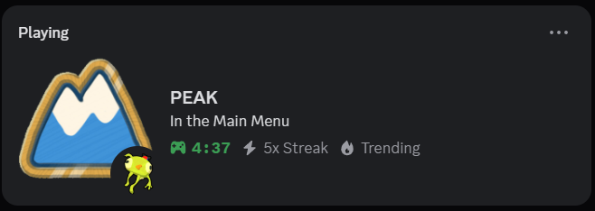
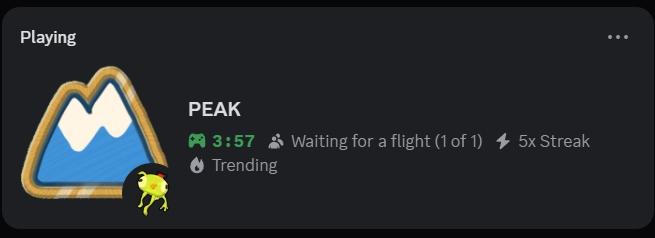
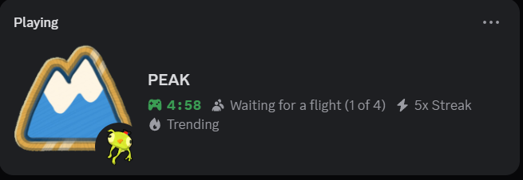
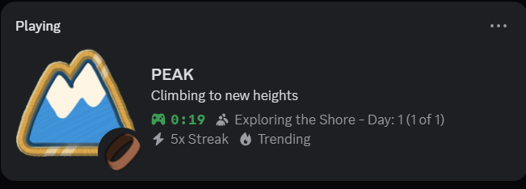
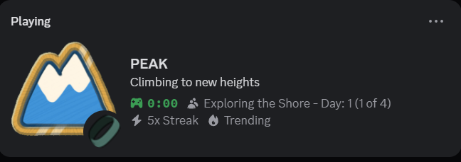
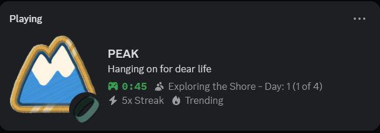
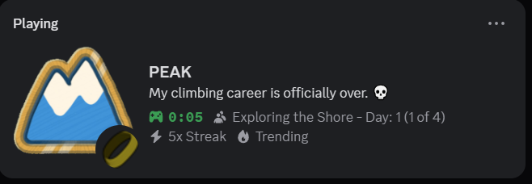

# PEAK Discord RPC Mod

Showcase your PEAK gameplay to your friends on Discord with this simple mod! The mod integrates Discord Rich Presence into the game, displaying your in-game activity directly on your profile. Your friends will know what level you're on, your current state, and how long you've been playing in real time.

## Key Features

- **Track your progress:** Displays your current biome, group size, and difficulty level (e.g., Peak, Ascent 1).
- **Show your status:** Friends can see your current state, whether you're alive, dead, or unconscious.
- **Real-time updates:** The rich presence updates automatically as you play.

## Installation

1. First, install [BepInEx for PEAK](https://thunderstore.io/c/peak/p/BepInEx/BepInExPack_PEAK/) if you haven't already.
2. Download the latest release of the PEAK Discord RPC mod from the [Releases](https://github.com/X-rays5/peak-DiscordRPC/releases) page.
3. Extract the contents of the downloaded ZIP file into the `BepInEx/plugins` directory of your PEAK installation. If the plugins folder doesn't exist, create it.
4. Launch the game to enjoy your enhanced Discord presence!

## Screenshots

Take a look at what the Rich Presence looks like in-game.

### Main menu

### In lobby

#### Solo

#### Multiplayer

### In game

#### Solo

#### Multiplayer

### Status

#### Unconscious

#### Dead

